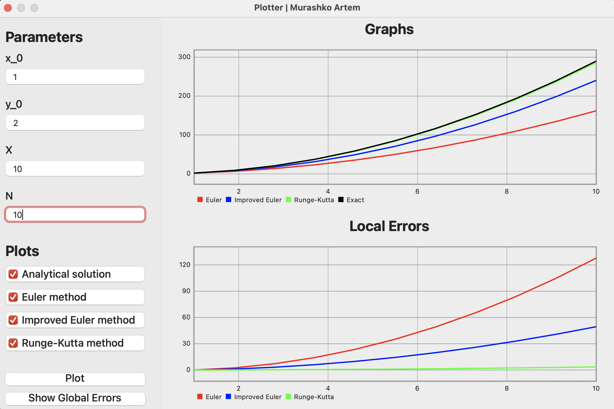
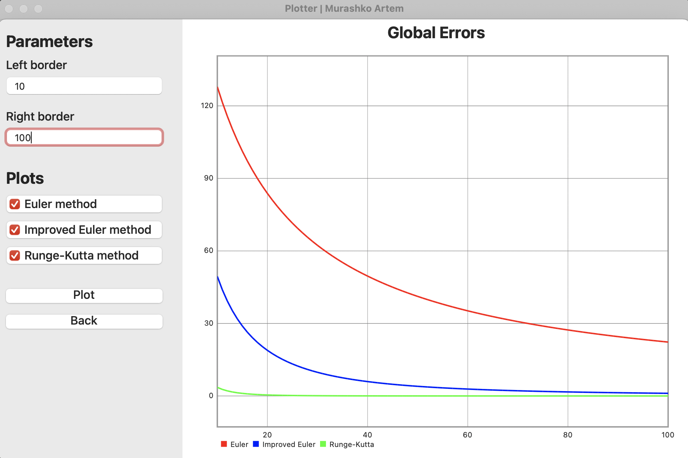
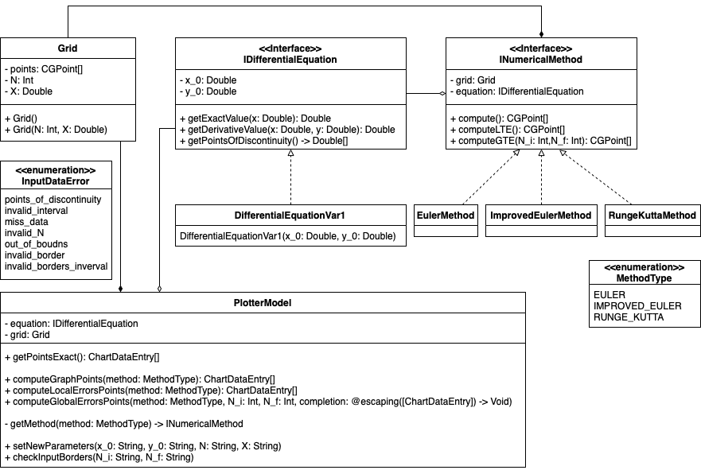

# Application with a graphical interface that allows to investigate numerical methods for solving a differential equation.

---

### Objectives

Implement using your favorite programming language, an application with a graphical interface that allows to investigate numerical methods for solving a differential equation.

### Tasks

1. Analytically solve differential equation
2. Implement Euler, Improved Euler and Runge-Kutta methods 
3. Implement the exact solution of IVP 
4. Implement GUI that allow user to change $x_0, y_0, X, N$ and plot the graphs of exact solution, its numerical methods and local truncation errors.
5. Implement GUI that allow user to change the range of grid steps to compare global truncation errors of numerical methods.

### Technologies used, GUI description

For this computational practicum, I have used Swift programming language and third-party library "Charts" as a graphing tool.
In this application Model-View-Controller design pattern is used, code is organized within SOLID principles.

The app has two screens. The first screen is used to display plots of approximations obtained by numerical methods and plots of Local Truncation Errors. User is allowed to change $x_0, y_0, X, N$ values.



The second screen contains Global Truncation Errors plots. User is allowed to change the range of grid steps to compare global truncation errors of numerical methods.



Each screen has checkboxes that allow to show/hide plots describing a correspondent solution. Text fields in which the user enters the data described above. Plot button that displays plots based on data from text fields and checkboxes. The application also contains error handling, which prevents the user from entering incorrect data.

### UML diagram



I have a PlotterModel class in which contains all logic. This is where I get graphs points for  plotting, catch errors, and so on. This class allows not to transfer the calculation logic to the controller, thereby adhering to the MVC design pattern. 

Code uses protocols that in Swift is something between interfaces and abstract classes. It allows to have non final fields and unimplemented methods. The IDifferentialEquation protocol stores the initial x, y values and methods for obtaining the value of the analytical solution, the derivative of a given function, and method returning discontinuities points array. Protocol INumericalMethod contains Grid class, which will contain plot points, IDifferentialEquation protocol field, which will contain equation we want to solve, and methods with calculation logic which inherited classes will implement.

The protocol IDifferentialEquation is implemented by classes EulerMethod, ImprovedEulerMethod and RungeKuttaMethod. 

Let's take a look at one of them:

The class EulerMethod contains constant fields grid and equation, as well as a constructor. Constructor takes an equation as input, and parameters N, X with which we will initialize the grid class.

```swift
class EulerMethod: INumericalMethod {    
    let grid: Grid
    let equation: IDifferentialEquation
    
    init(solve equotion: IDifferentialEquation, N: Int, X: Double) {
        self.equation = equotion
        self.grid = Grid(N: N, X: X)
    }
 }
```

Function compute() computes plot points of Euler method. First of all we need to calculate $h = \frac{X - x_0}{N}$ and then applying Euler method for N points. 

Euler method: $y_k = y_{k-1} + hf(x_{k-1}, y_{k-1)}$. So the first points is $(x_0, y_0)$ and then I create a loop from $i = 1$  to $N$ where on each step i get $x_{i-1}, y_{i-1}$. Calculating $x_i = x_{i-1} + h, y_i = h*equation.getDerivativeValue(x_{i-1}, y_{i-1}) + y_i$ we will get new point.

```swift
func compute() -> [CGPoint] {
        let h = (grid.getX() - equation.x_0) / (Double(grid.getN()))
        
        grid.points.append(CGPoint(x: equation.x_0, y: equation.y_0))
        for i in 1 ... grid.getN() {
            let x_prev = grid.points[i - 1].x
            let y_prev = grid.points[i - 1].y
            
            let x = x_prev + h
            let y = h * equation.getDerivativeValue(x: x_prev, y: y_prev) + y_prev
            grid.points.append(CGPoint(x: x, y: y))
        }
        
        return grid.points
    }
```

Function computeLTE() computes Local Truncation Errors. Firstly, I get the points from compute() method, after that I iterate through each point and calculate errors as $error = |y_{exact}(x) - y_{euler}(x)|$.

```swift
func computeLTE() -> [CGPoint] {
        var errorPoints = [CGPoint]()
        let graphPoints = compute()
        
        for point in graphPoints {
            let error = abs(equation.getExactValue(x: point.x) - point.y)
            errorPoints.append(CGPoint(x: point.x, y: error))
        }
        
        return errorPoints
    }
```

ComputeGTE() function which computes Global Truncation Error. It has as input parameters left and right borders $(N_i, N_f)$. For every step we compute LTE points for current N and then we look for the maximum point value. This maximum value we save as a new point.

```swift
func computeGTE(from N_i: Int, to N_f: Int) -> [CGPoint] {
        var errorPoints = [CGPoint]()
        
        for n in N_i ... N_f {
            let newMethod = EulerMethod(solve: equation, N: n, X: grid.getX())
            let LTEpoints = newMethod.computeLTE()

            let mx = LTEpoints.max() { $0.y < $1.y}
            errorPoints.append(CGPoint(x: CGFloat(n), y: mx?.y ?? 0.0))
        }
        
        return errorPoints
    }
}
```

Full source code you can find at GitHub.

[Online] Available: [https://github.com/art22m/F21-Plotter](https://github.com/art22m/F21-Plotter)

## Results

As we can understand from the plots of local truncation errors, the Runge-Kutta method turns out to be the most accurate, and the Euler method is the opposite. But any numerical method, with an increase in the number of steps, gives us a more accurate result, which can be clearly seen on the plot of global truncation errors. Since the plots of GTE are decreasing functions, with an infinitely large number of steps, numerical methods will allow us to search for exact solutions of differential equations.

## Conclusion

An application was created as a result of the computational practicum to demonstrate the performance of various numerical methods for approximating of ordinary differential equation solution. For the investigation of numerical methods, the user can change the initial values. LTE and GTE plots are also included, allowing the user to investigate the numerical methods more conveniently.
